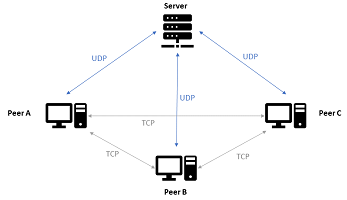

# p2p-ufabc

P2P system for transferring video files between Peers, intermediated by a centralized server, using UDP for communication with the Server and TCP between Peers.

Project developed for the subject Distributed Systems at Federal University of ABC - Brazil.

This project is based on JDK 1.8.

## Executing the project

Create a new Java Project on Eclipse IDE 2020-06 and name the package as *project*

### External libs
https://github.com/google/gson version 2.8.7

Copy and paste the external lib to:

` C:\<project_path>\bin `
From Windows, open the command line (cmd) and change directory to the project path:

` cd C:\<project_path>\bin `

### Server
First, initialize the server. Execute:

` java -cp gson-2.8.7.jar; project.Servidor `

### Peer
Then, the peer:

` java -cp gson-2.8.7.jar; project.Peer `

## Observations
- The Peer path cannot have spaces.
- The file names cannot have spaces or commas.
